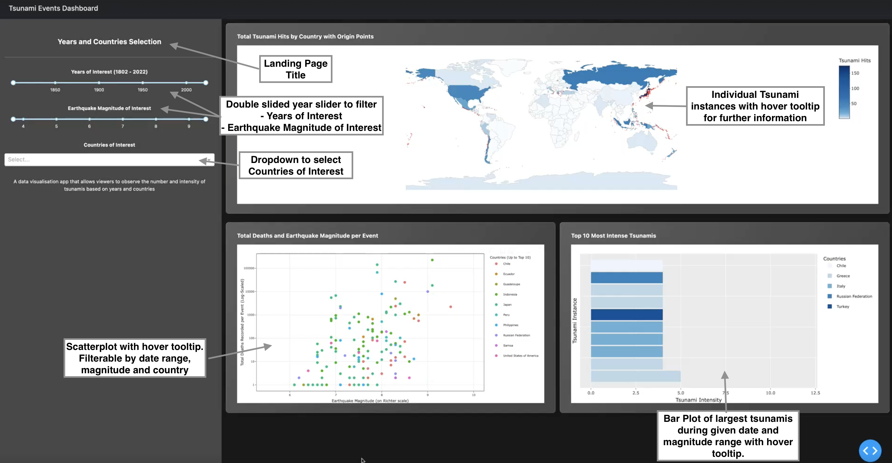

# Tsunami Events Dashboard (R)

## Accessing the App via Heroku

Link to Live App: [Tsunami Events Dashboard](https://tsunami-events-dashboard-r.herokuapp.com/)

## Description of the App Interface

This app contains a landing page with three tiles: an interactive geographical map that users can pan across to see the location of each tsunami as well as its strength, a time series graph showing the number of deaths by country, and a table listing the strongest tsunamis. The tsunami events data underlying the three plots is filtered for using a collapsible menu that contains two widgets: a slider to select a range of years of occurrence, and a drop-down menu to filter for countries impacted. The geographical map makes use of the tsunami latitude and longitude location data, generates a heat map to indicate tsunami magnitude, and allows users to hover over tsunami events plotted on the map to glean more comprehensive event details. Users can also peruse of a table listing the strongest tsunami events per the year and country selection applied, with the option to select from among a display of the top 5, 10 , 20 strongest events. Lastly, the time series graph shows the number of deaths by country per the year and country selection applied.

## Proposal

Our proposal can be found via this link: [proposal](docs/proposal.md)

## Dashboard Sketch

## Accessing the App Locally

To run and explore the app locally, clone the git repo and install required dependencies:

    git clone https://github.com/UBC-MDS/tsunami-events-dashboard-R.git

Then, run the app:

    Rscript app.R

## Built with

-   [dash](https://dash.plotly.com/r) - Main server and interactive components
-   [ggplot2](https://ggplot2.tidyverse.org) - Used to generate interactive plots
-   [dplyr](https://dplyr.tidyverse.org/) - Used for data manipulation and pre-processing

## Contributing

| Contributors         | Github                |
|----------------------|-----------------------|
| Gautham Pughazhendhi | \@gauthampughazhendhi |
| Jacqueline Chong     | \@Jacq4nn             |
| Rowan Sivanandam     | \@Rowansiv            |
| Vadim Taskaev        | \@vtaskaev1           |

## License

