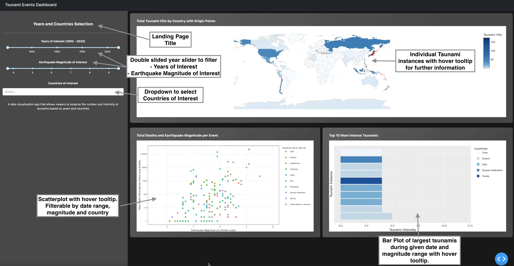

# Proposal

## Motivation and Purpose

Our role: Tsunami data science enthusiasts

Target Audience: Fellow tsunami enthusiasts

Vancouver sits on the edge of the Pacific Rim of Fire - a region where most of the volcanic eruptions and earthquakes occur. These eruptions occur in the middle of the Pacific Ocean and travel towards land as tsunamis. Each varies in magnitude and location and causes physical and economic damage. How do we track each tsunami that has occurred? How do we know how the magnitude of tsunamis changes over time? How can we compare the damage of each tsunami to another in the same year or between countries?

To address these questions, we propose building a data visualization app that allows these enthusiasts to visually explore a dataset of past tsunami instances over the past few hundred years (the data set consists of tsunamis from 2100BC, but we have decided to limit it to 1800AD). Our app will show how the distribution of tsunamis varies over time, and users can use the tooltip to find out more information about each tsunami. It will also list the top 10 tsunamis that occur in the given time period that the user has selected.

## Description

We will be visualizing 2167 tsunami instances (out of the possible 2767 instances). While the dataset has many associated variables, the key variables are as follows. Each tsunami instance has time information (`Year`, `Mo`, `Dy`, `Hr`, `Mn`, `Sec`), geographical position (`Country`, `Location Name`, `Latitude`, `Longitude`), hydrological condition (`Maximum Water Height`, `Earthquake Magnitude`), and damage (`Total Deaths`, `Total Injuries`, `Total Missing`, `Total Damage ($Mil)`, `Total Houses Destroyed`).

## Research Questions and Usage Scenarios

Victoria, a recent Accounting graduate from The University of British Columbia, has recently been hired by an insurance company within the Greater Vancouver Area. She is often asked to [explore] data pertaining to home insurance premiums in relation to bundled insurance products purchased by clients. While she is aware that British Columbia’s coastal residential developments are at risk of considerable property damage should a tsunami event occur in the Pacific Rim of Fire, she is curious to learn more about the relative frequency and estimated damage from such events across the world throughout recent history. Fortunately, thanks to her interest in data science, she recently came across the `tsunami-events-dashboard-R`, a simple dashboard repository that allows her to put in perspective the purpose and valuation of optional comprehensive coverage related to tsunami-related flooding and earthquake damage. Thanks to this tool, she is able to [look up] the geographic location of historical tsunami events and [plot] their relative frequency per select country for a given specified time interval of her choice. In addition, she can [generate] a list of tsunami events in descending order of magnitude based on the time and country selection specified to [identify] those that may be relevant for her to investigate in more detail.

## Dashboard Sketch

